# @neonox31/node-red-contrib-zigate

This repository contains a set of [node-red](https://nodered.org/) nodes to interract with [zigate](https://zigate.fr) gateway.

All nodes depends of my personnal typescript library located [here](https://github.com/Neonox31/zigate)

⚠ **This is not a zigate official repo**

## Install

### Use node-red palette
Simply search for `@neonox31/node-red-contrib-zigate` and press `install` button.

### Manually
Use `npm i @neonox31/node-red-contrib-zigate` or `yarn add @neonox31/node-red-contrib-zigate` inside `.node-red` directory.

## Nodes

### zigate-config
This node is a node-red [configuration node](https://nodered.org/docs/creating-nodes/config-nodes) and permits to share zigate configuration between all other ziagte nodes in all flows.

Currently, only one **mandatory** parameter is available which is the serial port of the plugged zigate USB dongle :
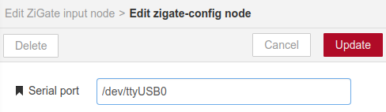

### zigate-in

This node listens to all zigate messages and transmit them as a node-red message payload.
The zigate message code is also transmitted as node-red message topic.

#### Basic implementation
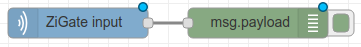

```
[{"id":"e183e7fe.821428","type":"zigate-in","z":"e4ab82f1.ccd66","name":"","zigate":"dbb094c2.e34978","x":430,"y":300,"wires":[["fb12d3f6.f1083"]]},{"id":"fb12d3f6.f1083","type":"debug","z":"e4ab82f1.ccd66","name":"","active":true,"tosidebar":true,"console":false,"tostatus":false,"complete":"false","x":610,"y":300,"wires":[]},{"id":"dbb094c2.e34978","type":"zigate-config","z":"","serialPort":"/dev/ttyUSB0"}]
```

#### Payload example
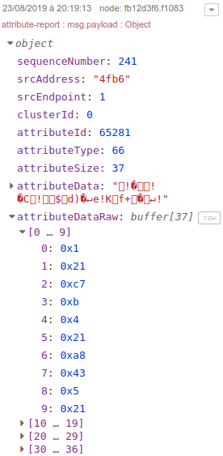

### zigate-out

This node is used to send commands to zigate.

The zigate message code should be specified as node-red message topic **with decimal format**.
The node-red payload is optional and could be used to override default command parameters like `interval` for `permit join` command for example. 
(Available commands are located [here](https://github.com/Neonox31/zigate/tree/master/src/commands))

#### Basic implementation
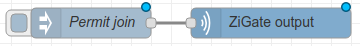

```
[{"id":"f1b301d.3652","type":"zigate-out","z":"e4ab82f1.ccd66","name":"","zigate":"dbb094c2.e34978","x":660,"y":460,"wires":[]},{"id":"e357bf4f.b90d5","type":"inject","z":"e4ab82f1.ccd66","name":"Permit join","topic":"73","payload":"{\"interval\":30}","payloadType":"json","repeat":"","crontab":"","once":false,"onceDelay":0.1,"x":480,"y":460,"wires":[["f1b301d.3652"]]},{"id":"dbb094c2.e34978","type":"zigate-config","z":"","serialPort":"/dev/ttyUSB0"}]
```

#### Message example
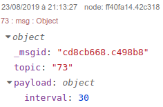

### zigate-xiaomi-aqara-weather-sensor
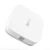

This node retrieves data from Xiaomi Aqara Temperature Humidity Sensor using zigate.

This node is a device node, so you **should specify the zigate device short address** in its properties:

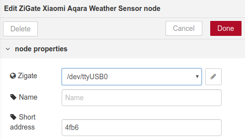

#### Basic implementation
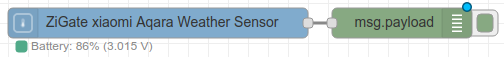

```
[{"id":"27c7dcfc.507854","type":"zigate-xiaomi-aqara-weather-sensor","z":"245ccd2c.8c7e52","zigate":"dbb094c2.e34978","name":"","shortAddress":"4fb6","x":190,"y":100,"wires":[["6d5acc1e.924474"]]},{"id":"6d5acc1e.924474","type":"debug","z":"245ccd2c.8c7e52","name":"","active":true,"tosidebar":true,"console":false,"tostatus":false,"complete":"false","x":434,"y":100,"wires":[]},{"id":"dbb094c2.e34978","type":"zigate-config","z":"","serialPort":"/dev/ttyUSB0"}]
```

#### Payload examples
Each new measure is provided as a separate node-red message :

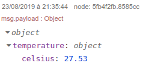

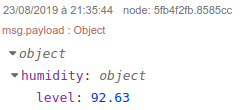

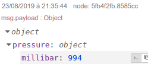
